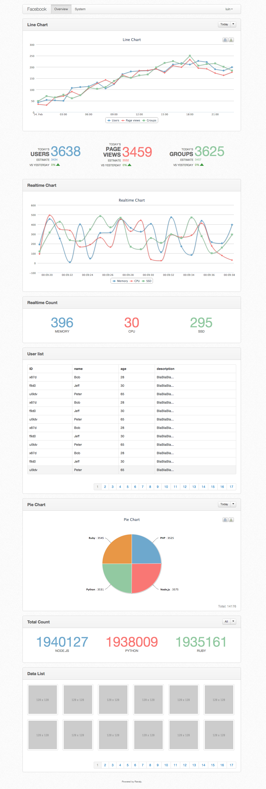
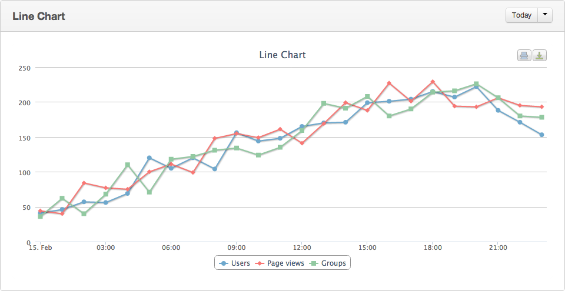
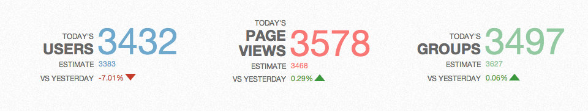
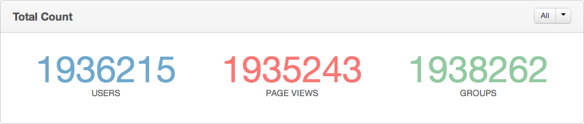
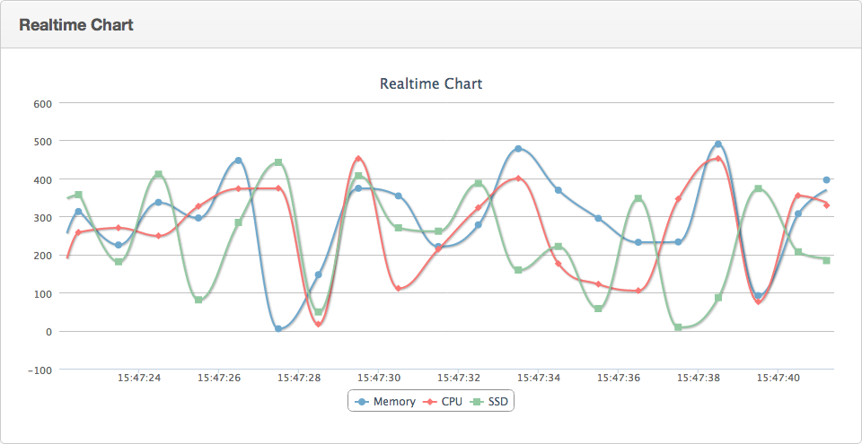
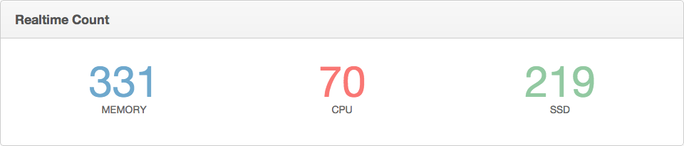
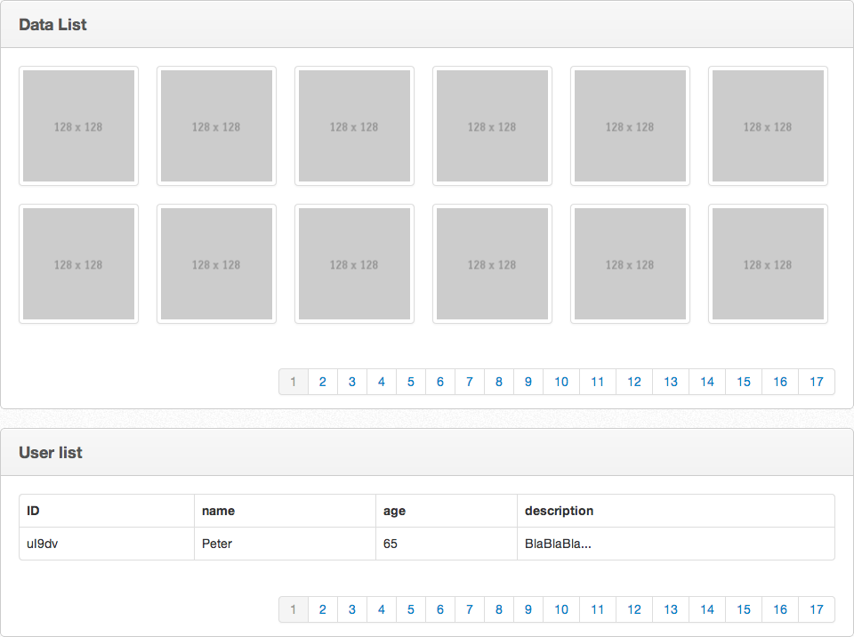

# Ranaly
Ranaly是一个基于Redis的数据统计可视化工具。

Ranaly的Node.js客户端库[node_ranaly](https://github.com/luin/node_ranaly)已经完成。

特点如下：

1. 使用简单，容易维护
2. 基于Redis，性能优异
3. 支持模块级别的权限控制
4. 长连接实时数据统计
5. 多种图表可以选择，可以自定义模板、模块

## 快速入门
在项目中使用Ranaly统计数据十分简单，步骤如下。
### 1. 安装Node.js和Redis
Ranaly使用Node.js开发，所以需要先安装[Node.js](http://nodejs.org/)。同样因为Ranaly的统计数据存储于Redis中，所以需要安装[Redis](http://redis.io/)。
### 2. 安装Ranaly

	git clone git://github.com/luin/ranaly.git
	cd ranaly
	npm install

### 3. 在已有项目中加入统计代码
如果你的项目使用Node.js开发，可以使用Ranaly的node客户端库，安装方法如下：
	
	npm install ranaly

如果希望统计项目注册用户的变化趋势，可以在用户注册成功后加上如下代码：

	var ranaly = require('ranaly').createClient();
	var rUsers = new ranaly.Amount('Users');
	rUsers.incr();

node_ranaly库会将名为“Users”的Amount类型的桶的值增1并和当前时间一起写入到Redis中。

### 4. 查看统计结果
建立配置文件，内容如下：
	
	app_name: Demo
	users:
	  - username: admin
	    password: admin123
	pages:
	  - title: Overview
	    widgets:
	      - type: amount_line_chart
	        bucket: Users

将文件保存，并进入Ranaly的目录执行：

	node ranaly /path/to/config_file

其中`/path/to/config_file`表示配置文件路径。此时就可以访问 http://127.0.0.1:3000 进入数据查看页面了，使用admin和admin123登录系统，能看到用户数量的折线图。
	
## 文档
Ranaly由两个部分组成，分别是客户端库和数据展示部分，本页面项目是数据展示部分。在程序中通过客户端库在Redis中记录统计数据，而本页面项目的作用是将这些数据以图表的形式显示出来。

### 1. 客户端库
Node.js：[node_ranaly](https://github.com/luin/node_ranaly)

### 2. 数据类型
为了适应不同场合的统计需要，Ranaly支持3种类型的数据统计：

#### (1) Amount
当要记录某一个数据的在不用时间的数量变化时就需要使用Amount类型，如想记录用户数量的变化趋势等。

#### (2) Realtime
Realtime用来记录实时数据，如当前系统内存使用情况等。

#### (3) DataList
DataList用来记录数据列表，数据可以是数字、字符串甚至对象。如新注册的用户头像地址列表、新注册的用户资料列表等。DataList只保留数据列表中的前N条数据（N的数值可以指定）。

### 3. Ranaly配置文件
为了能够通过Ranaly来将Redis中记录的统计数据可视化，需要提供一份配置文件。配置文件的格式为YAML，样例如下：

	app_name: 应用名称
	port: Ranaly使用的端口号，默认是3000
	redis:
		host: Redis的主机地址，默认是127.0.0.1
		port: Redis的端口号，默认是6379
		key_prefix: 存储统计数据的键名前缀，需要和客户端库的配置一样
	users:
		- username: 用户名
		  password: 密码
		  role: 数字，表示用户的权限，默认是0
	pages:
		- title: 页面的标题
		  widgets:
		  	  - type: widget的类型
		  	    bucket: widget对应的bucket
		  	    title: widget的标题
			    role: 数字，只对拥有大于或等于该role的用户可见

### 4. 桶（bucket）
为了区分不同的统计数据，需要为每类数据起个名字（桶），如统计用户名称的桶可以命名为“Users”，统计访问量的桶可以命名为“Page views”。不同数据类型的桶可以重名，桶的名称可以包含空格。

### 5. Widget类型
在配置文件中可以看到每一个项目是由若干个page组成的，每个page由若干个widget组成。widget分为不同种类，每一种widget只适用于一种数据类型，可以从其命名看出来。

#### (1) amount_line_chart
该类型的widget用来显示折线图，只支持Amount。每个widget除了type、bucket、title和role四个参数外还支持其它不同的参数。amount_line_chart类型支持的参数如下：

|      参数名      |    意义     |                               取值                                |
|---------------|-----------|-----------------------------------------------------------------|
| default_range | 默认显示的时间范围 | today（显示当天的数据），yesterday（昨天的数据），7days（最近7天的数据），30days（最近30天的数据） |
| update_interval | 数据更新间隔，默认为20-40秒 | 数字，单位为秒                                                                   |

amount_line_chart支持同时显示多个bucket的数据，在配置文件中以数组形式设置，如：

	type: amount_line_chart
	bucket: [Users, Page views, Groups]

#### (2) amount_pie_chart
用来显示饼图。amount_pie_chart类型支持的其它参数如下：

|      参数名      |    意义     |                                    取值                                     |
|---------------|-----------|---------------------------------------------------------------------------|
| default_range | 默认显示的时间范围 | today（显示当天的数据），yesterday（昨天的数据），7days（最近7天的数据），30days（最近30天的数据），all（所有数据） |
| update_interval | 数据更新间隔，默认为20-40秒 | 数字，单位为秒                                                                   |

amount_pie_chart支持同时比对多个bucket的数据。

#### (3) amount_today_count
用来显示当天的数据，并根据昨天同时间的数据预测今天的全天的数据。支持的其它参数如下：

|      参数名      |    意义     |                                    取值                                     |
|---------------|-----------|---------------------------------------------------------------------------|
| update_interval | 数据更新间隔，默认为20-40秒 | 数字，单位为秒                                                                   |

amount_today_count支持同时显示多个bucket的数据。

#### (4) amount_total_count
显示某一时间范围的数据总和，如最近30天注册的用户总数。支持的其它参数如下：

|      参数名      |    意义     |                                    取值                                     |
|---------------|-----------|---------------------------------------------------------------------------|
| update_interval | 数据更新间隔，默认为20-40秒 | 数字，单位为秒                                                                   |

amount_total_count支持同时显示多个bucket的数据。

#### (5) realtime_line_chart
显示实时数据的折线图，更新频率是1秒。

realtime_line_chart支持同时显示多个bucket的数据。

#### (6) realtime_count
显示实时数据的数值，更新频率是实时。

realtime_count支持同时显示多个bucket的数据。

#### (7) datalist_list
显示DataList数据列表。由于DataList类型可以存储任何数据的列表，所以该类型的widget支持高度自定义。可以通过template参数指定显示DataList的模板，模板采用[Mustache](http://mustache.github.com/)，渲染的数据格式是{"data": [*数据列表*]}。下面的实例中还会对此进行介绍。除此之外还支持count_per_page参数用来指定每页要显示的数据条数。

#### (8) custom_code
该widget类型比较特殊，无需bucket参数，只需要content参数。作用是执行自定义的代码，包括HTML/CSS/JavaScript。如：

      - type: custom_code
        content: >
          
hi

## 综合实例
现在假设要统计Facebook网站的数据，以使用Ranaly的Node.js客户端为例。首先我们通过node_ranaly建立到Redis的连接（假设Redis运行在本机6380端口上）：

	var ranaly = require('ranaly');
	var ranalyClient = ranaly.createClient('127.0.0.1', 6380);

首先要统计的是用户的数量，每当用户注册成功都调用如下代码令Users桶的数值加1：

	var rUsers = new ranalyClient.Amount('Users');
	rUsers.incr();

然后我们要统计网站的访问量，每当访问一个页面时，都执行：

	var rPageViews = new ranalyClient.Amount('Page views');
	rPageViews.incr();
	
现在来配置Ranaly可视化部分来显示我们的统计数据：

	app_name: Facebook
	redis:
		host: 127.0.0.1
		port: 6380
	users:
		- username: admin
		  password: admin123
	pages:
		- title: Overview
		  widgets:
		    - type: amount_line_chart
		      bucket: [Users, Page views]

在这个配置中，我们使用折线图来比对用户数量和访问量的关系。将该内容存为config.yaml，然后执行：

	$ node ./ranaly.js /path/to/config.yaml
	Ranaly server listening on port 3000

此时就可以通过http://127.0.0.1:3000来访问了。

在Facebook中，用户可以发布文字状态、照片和视频，若想统计这3种类型的状态的比例，可以在发布时执行：

	var bucket = '';
	switch (status.type) {
	case 'text':
		bucket = 'Text';
		break;
	case 'photo':
		bucket = 'Photo';
		break;
	case 'video':
		bucket = 'Video';
		break;
	}
	var rStatus = new ranalyClient.Amount(bucket);
	rStatus.incr();

然后我们接着编辑config.yaml，在widgets中加入：

			    - type: amount_pie_chart
			      bucket: [Text, Photo, Video]
		
这时重新启动Ranaly服务器（每次修改config.yaml都得重启），可以看到显示3者比例的饼图，并且可以随意调整时间范围。

接下来显示服务器的资源，包括内存和CPU：

	var rMemory = new ranalyClient.Realtime('Memory');
	var rCPU = new ranalyClient.Realtime('CPU');
	setInterval(function () {
		rMemory.set(System.getUsedMemory());
		rCPU.set(System.getUsedCPU());
	}, 100);

嗯...好像是没有System.getUsedMemory()和System.getUsedCPU()这两个东西，不过只要知道他们都会返回个数字就好了。

同样我们接着编辑config.yaml，在widgets中加入：

			    - type: realtime_count
			      bucket: [Memory, CPU]

重启服务器，就可以看到空闲的内存和CPU资源了。每次Realtime类型的数据更新都会推送给Ranaly服务器，所以页面上显示的数值每100毫秒变一次。

现在我们还希望能在Ranaly页面中看到用户最新上传的头像，所以我们在头像上传成功后执行：

	var rAvatar = new ranalyClient.DataList('Avatar');
	rAvatar.push(avatarURL, 100);

其中`avatarURL`是一个字符串，存储用户头像的URL地址。100表示只存储最新的100条记录，防止数据占用过多的内存（因为数据是存储在Redis中的）。

接着我们来配置config.yaml：

			    - type: datalist_list
			      bucket: [Avatar]

默认会以列表的形式展示数据，不是很好看，所以我们来自定义模板。Ranaly使用了BootStrap框架，所以可以在模板中自由使用BootStrap的风格。我们将数据修改成：

			    - type: datalist_list
			      bucket: [Avatar]
			      template: >
						<ul class="thumbnails" style="margin-right: -20px">
						  {{#data}}
						  <li class="span2" style="width: 135px">
						    
						  </li>
						  {{/data}}
						</ul>

对于展示图片，Ranaly提供了一个预置的模板，可以这样写：

			    - type: datalist_list
			      bucket: [Avatar]
			      preset_template: images

接着我们想记录最近注册成功的用户的资料，则在用户注册成功后执行：

	var rUsers = new ranalyClient.DataList('Users');
	rUsers.push({
		id: user.id,
		name: user.name,
		age: user.age,
		description: user.description
	}, 100);

然后修改配置文件：

			    - type: datalist_list
			      bucket: [Users]
			      template:
			          <table class="table table-hover table-bordered">
			            <thead>
			              <tr>
			                <th>ID</th>
			                <th>name</th>
			                <th>age</th>
			                <th>description</th>
			              </tr>
			            </thead>
			            <tbody>
			              {{#data}}
			              <tr>
			                <td>{{id}}</td>
			                <td>{{name}}</td>
			                <td>{{age}}</td>
			                <td>{{description}}</td>
			              </tr>
			              {{/data}}
			            </tbody>
			          </table>

就可以看到记录最新注册用户资料的表格了。
