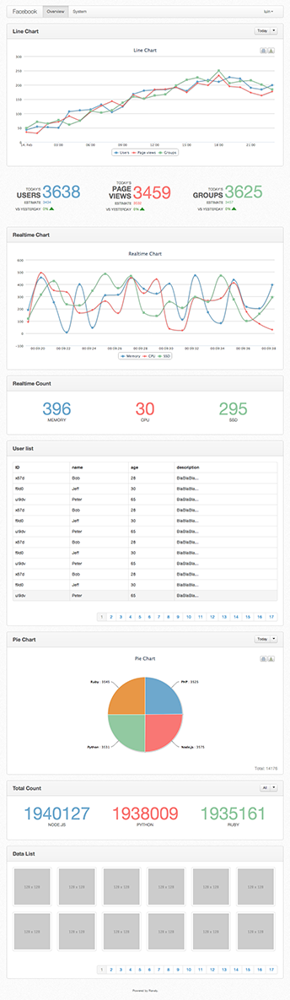

# Ranaly
Ranaly是一个基于Redis的数据统计可视化工具。目前还在开发中，会于2013年2月底完成。

Ranaly的Node.js客户端库[node_ranaly](https://github.com/luin/node_ranaly)已经完成。

特点如下：

1. 使用简单，容易维护
2. 基于Redis，性能优异
3. 支持模块级别的权限控制
4. 长连接实时数据统计
5. 多种图表可以选择，可以自定义模板、模块

## 快速入门
在项目中使用Ranaly统计数据十分简单，步骤如下。
### 1. 安装Node.js和Redis
Ranaly使用Node.js开发，所以需要先安装[Node.js](http://nodejs.org/)。同样因为Ranaly的统计数据存储于Redis中，所以需要安装[Redis](http://redis.io/)。
### 2. 安装Ranaly

	git clone git://github.com/luin/ranaly.git
	cd ranaly
	npm install

### 3. 在已有项目中加入统计代码
如果你的项目使用Node.js开发，可以使用Ranaly的node客户端库，安装方法如下：
	
	npm install ranaly

如果希望统计项目注册用户的变化趋势，可以在用户注册成功后加上如下代码：

	var ranaly = require('ranaly').createClient();
	var rUsers = new ranaly.Amount('Users');
	rUsers.incr();

node_ranaly库会将名为“Users”的Amount类型的桶的值增1并和当前时间一起写入到Redis中。

### 4. 查看统计结果
建立配置文件，内容如下：
	
	app_name: Demo
	users:
	  - username: admin
	    password: admin123
	pages:
	  - title: Overview
	    widgets:
	      - type: amount_line_chart
	        bucket: Users

将文件保存，并进入Ranaly的目录执行：

	node ranaly /path/to/config_file

其中`/path/to/config_file`表示配置文件路径。此时就可以访问 http://127.0.0.1:3000 进入数据查看页面了，使用admin和admin123登录系统，能看到用户数量的折线图。
	
